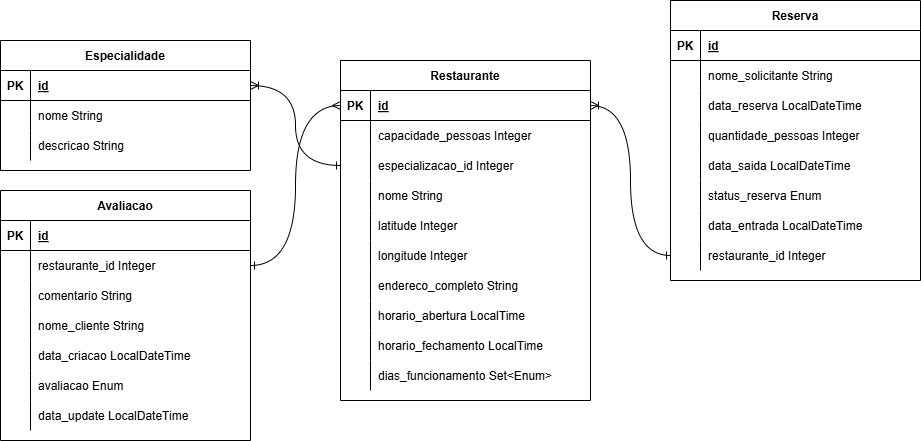

# Tech Challenge 03 - Restaurante

- Introdução
- Funções
- Tecnologias
- Infraestrutura Cloud
- Instalação
- Banco de dados
- Fluxo principal
- API

***

## Introdução

Esta aplicação é um sistema de reserva de avaliação de restaurantes desenvolvido com o framework Springboot. Através dele se pode cadastrar restaurantes e suas especialidades (cozinhas), gerenciar as ruas reservas, buscar restaurantes e avaliá-los.

O projeto pode ser acessado em: https://github.com/eduardoesr/tech-challenge-03

***

## Funções

* Cadastrar especialidade (cozinha) de restaurante.
* Cadastrar restaurantes.
* Avaliar restaurantes.
* Buscar restaurantes, podendo ver as suas avaliações e especialidade.
* Gerenciar reservas de um restaurante.

***

## Tecnologias

* Springboot: Framework web
* Gradle: Gerenciador de dependências
* Swagger: Documentação e interface para testes
* H2: Banco de dados SQL em memória (local)
* PostgreSQL: Banco de dados SQL (cloud)
* AWS RDS: Serviço do AWS de banco de dados
* AWS Lambda: Serviço do AWS para executar código sem gerenciar servidores
* AWS API Gateway: Serviço do AWS para acessar APIs

***

## Infraestrutura cloud


<div align="center">
    
</div>

Foi feito deploy do serviço no Amazon Web Services utilizando API Gateway + Lambda + RDS com PostgreSQL. Foi definido essa infraestrutura por ter um gerenciamento bem simples e ser de baixo custo. 

A API pode ser acessada em `https://twyexn7q1l.execute-api.us-east-1.amazonaws.com/dev/`.

Todos os endpoints listados no tópico de API são acessíveis neste link. Por exemplo, `GET /restaurante` seria `GET https://twyexn7q1l.execute-api.us-east-1.amazonaws.com/dev/restaurante`. 

Neste caso em específico, por se tratar de um endpoint GET, pode ser acessado diretamente pela URL:

<div align="center">
    
</div>

***

## Instalação

* Instalar Java 17 e o Gradle.
* Baixe os arquivos repositório. `https://github.com/eduardoesr/tech-challenge-03`.
* Entre na pasta do repositório. `cd tech-challenge-03`.
* Execute o projeto com Gradle.
    * Utilize este comando no terminal: `./gradlew bootRun`.
    * No Windows, caso esteja utilizando CMD, use: `gradlew.bat bootRun`.

O Swagger pode ser acessado diretamente em `http://localhost:8080/swagger-ui/index.html`.

***

## Banco de dados


<div align="center">
    
</div>

***

## Fluxo principal

Você deve inicialmente cadastrar uma especialidade (`POST /create-especialidade`) e cadastrar um restaurante (`POST /create-restaurante`) com essa especialidade. Então se pode criar avaliações com (`POST /create-avaliação`) e reservas com (`POST /create-reserva`).

Todas essas entidades, Especialidade, Restaurante, Reserva e Avaliação, possuem endpoints para criação, leitura, atualização e deletar. 

Para a reserva, além desses foram criados endpoints específicos para simplificar a atualização de status: (`PUT /update-reserva/{id}/iniciar`), (`PUT /update-reserva/{id}/finalizar`) e (`PUT /update-reserva/{id}/cancelar`). O endpoint (`GET /reserva/{id}/`) deve receber o id do restaurante, e irá informar todas as reservas daquele restaurante.

### Cadastrar especialidade: `POST /create-especialidade`
Exemplo de envio:
  ```
{
  "nome": "Nome especialidade",
  "descricao": "Descrição"
}
  ```

### Cadastrar restaurante  `POST /create-restaurante`
Exemplo de envio:
```
{
  "especialidadeId": 0,
  "capacidadePessoas": 10,
  "nome": "Nome restaurante",
  "latitude": 0,
  "longitude": 0,
  "enderecoCompleto": "Endereço",
  "horarioAbertura": "17:00:00",
  "horarioFechamento": "23:00:00",
  "diasFuncionamentos": [
    "SEG"
  ],
  "tolerancia": "00:15:00"
}
 ```
Observação: A tolerância se trata de um atraso máximo sem que haja cancelamento da reserva.

### Cadastrar avaliação `POST /create-avaliacao`
Exemplo de envio:
```
{
  "restauranteId": 0,
  "comentario": "Avaliação restaurante",
  "nomeCliente": "Nome do cliente",
  "valorAvaliacao": "PESSIMO"
}
 ```

### Cadastrar reserva `POST /create-reserva`
Exemplo de envio:
```
{
  "restauranteId": 0,
  "nomeCliente": "Nome do cliente",
  "quantidadePessoas": 1,
  "dataReserva": "2025-03-23T17:48:47.710Z"
}
 ```
Observação: A data da reserva deve ser entre o horário de abertura e de fechamento do restaurante, e o dia deve estar dentro do dia de funcionamento do restaurante.

### Atualizar reserva `PUT /update-reserva/{id}`
Exemplo de envio:
```
{
  "restauranteId": 0,
  "nomeCliente": "Nome do cliente",
  "quantidadePessoas": 1,
  "dataReserva": "2025-03-24T01:07:11.858Z",
  "dataSaida": "2025-03-24T01:07:11.858Z",
  "statusReserva": "PENDENTE"
}
 ```
Observação: Foi criado endpoints específicos de atualização da reserva que já definem um status:

`PUT /update-reserva/{id}/iniciar`

`PUT /update-reserva/{id}/finalizar`

`PUT /update-reserva/{id}/cancelar`

O endpoint de finalizar considera o momento da finalização como a data de saída. Estes endpoints não precisam de corpo.

***

## API

### Reserva

| Método | URL                            | Ação                                                        |
|--------|--------------------------------|-------------------------------------------------------------|
| PUT    | /update-reserva/{id}           | Atualiza uma reserva.                                       |
| PUT    | /update-reserva/{id}/iniciar   | Inicia uma reserva.                                         |
| PUT    | /update-reserva/{id}/finalizar | Finaliza uma reserva.                                       |
| PUT    | /update-reserva/{id}/cancelar  | Cancela uma reserva.                                        |
| POST   | /create-reserva                | Cria uma reserva.                                           |
| GET    | /reserva                       | Lista todas as reservas.                                    |
| GET    | /reserva/{id}                  | Lista todas as reservas do restaurante com id especificado. |
| DELETE | /delete-reserva/{id}           | Deleta uma reserva.                                         |

<br>

### Avaliação

| Método | URL                    | Ação                                    |
|--------|------------------------|-----------------------------------------|
| PUT    | /update-avaliacao/{id} | Atualiza uma avaliação.                 |
| POST   | /create-avaliacao      | Cria uma avaliação para um restaurante. |
| GET    | /avaliacao/{id}        | Localiza uma avaliação                  |
| DELETE | /delete-avaliacao/{id} | Deleta uma avaliação.                   |

<br>

### Especialidade

| Método | URL                        | Ação                           |
|--------|----------------------------|--------------------------------|
| PUT    | /update-especialidade/{id} | Atualiza uma especialidade.    |
| POST   | /create-especialidade      | Cria uma especialidade.        |
| GET    | /especialidade             | Lista todas as especialidades. |
| GET    | /especialidade/{id}        | Mostra uma especialidade.      |
| DELETE | /delete-especialidade/{id} | Deleta uma especialidade.      |

<br>

### Restaurante

| Método | URL                      | Ação                         |
|--------|--------------------------|------------------------------|
| PUT    | /update-restaurante/{id} | Atualiza um restaurante.     |
| POST   | /create-restaurante      | Cria um restaurante.         |
| GET    | /restaurante             | Lista todos os restaurantes. |
| GET    | /restaurante/{id}        | Mostra um restaurante.       |
| DELETE | /delete-restaurante/{id} | Deleta um restaurante.       |

Observação: Os endpoints GET de um restaurante não mostram apenas o ID, mas sim todos os detalhes da especialidade, avaliações e reservas daquele restaurante.